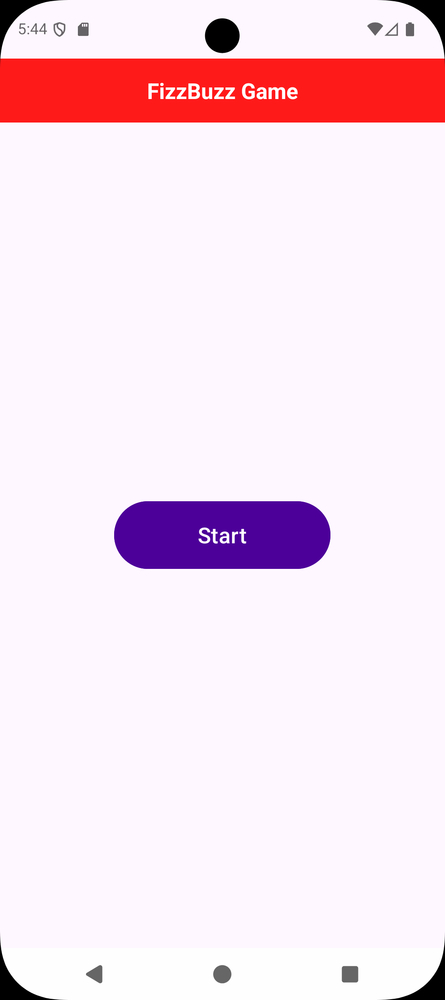
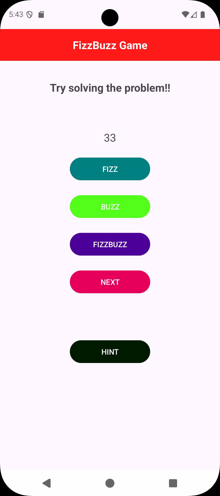

<h1>FizzBuzz Android Project</h1>

A simple Android application implementing the classic FizzBuzz logic. This project demonstrates basic loops, conditional statements, and UI interaction within the Android ecosystem.

<h3>🛠 Technologies Used</h3>
<ul>
  <li>IDE: Android Studio</li>
  <li>Language: Kotlin / Java</li>
  <li>Minimum SDK: API 24+</li>
</ul>

<h3>📖 About the Project</h3>

The FizzBuzz problem is a classic programming exercise. This app takes a range of numbers and outputs:

<ol>
  <li>"Fizz" if the number is divisible by 3.</li>
  <li>"Buzz" if the number is divisible by 5.</li>
  <li>"FizzBuzz" if the number is divisible by both 3 and 5.</li>
  <li>The number itself if none of the above conditions are met.</li>
</ol>

